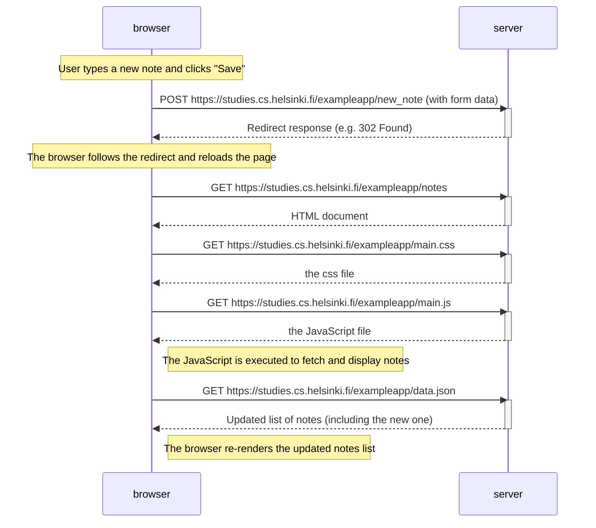

```mermaid
sequenceDiagram
    participant browser
    participant server

    Note over browser: User types a new note and clicks "Save"

    browser->>server: POST https://studies.cs.helsinki.fi/exampleapp/new_note (with form data)
    activate server
    server-->>browser: Redirect response (e.g. 302 Found)
    deactivate server

    Note over browser: The browser follows the redirect and reloads the page

    browser->>server: GET https://studies.cs.helsinki.fi/exampleapp/notes
    activate server
    server-->>browser: HTML document
    deactivate server

    browser->>server: GET https://studies.cs.helsinki.fi/exampleapp/main.css
    activate server
    server-->>browser: the css file
    deactivate server

    browser->>server: GET https://studies.cs.helsinki.fi/exampleapp/main.js
    activate server
    server-->>browser: the JavaScript file
    deactivate server

    Note right of browser: The JavaScript is executed to fetch and display notes

    browser->>server: GET https://studies.cs.helsinki.fi/exampleapp/data.json
    activate server
    server-->>browser: Updated list of notes (including the new one)
    deactivate server

    Note right of browser: The browser re-renders the updated notes list
```
