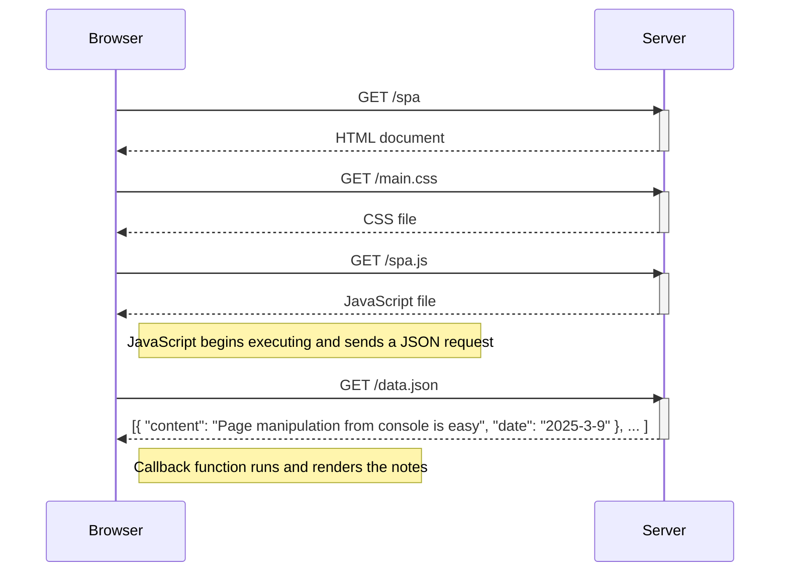

```mermaid
sequenceDiagram
    participant Browser
    participant Server

    Browser->>Server: GET /spa
    activate Server
    Server-->>Browser: HTML document
    deactivate Server

    Browser->>Server: GET /main.css
    activate Server
    Server-->>Browser: CSS file
    deactivate Server

    Browser->>Server: GET /spa.js
    activate Server
    Server-->>Browser: JavaScript file
    deactivate Server

    Note right of Browser: JavaScript begins executing and sends a JSON request

    Browser->>Server: GET /data.json
    activate Server
    Server-->>Browser: [{ "content": "Page manipulation from console is easy", "date": "2025-3-9" }, ... ]
    deactivate Server

    Note right of Browser: Callback function runs and renders the notes
```
