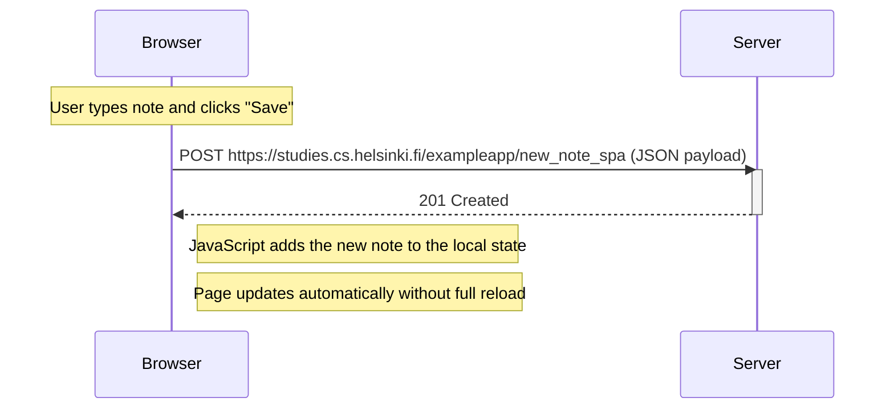

```mermaid
sequenceDiagram
    participant Browser
    participant Server

    Note over Browser: User types note and clicks "Save"

    Browser->>Server: POST https://studies.cs.helsinki.fi/exampleapp/new_note_spa (JSON payload)
    activate Server
    Server-->>Browser: 201 Created
    deactivate Server

    Note right of Browser: JavaScript adds the new note to the local state

    Note right of Browser: Page updates automatically without full reload
```
